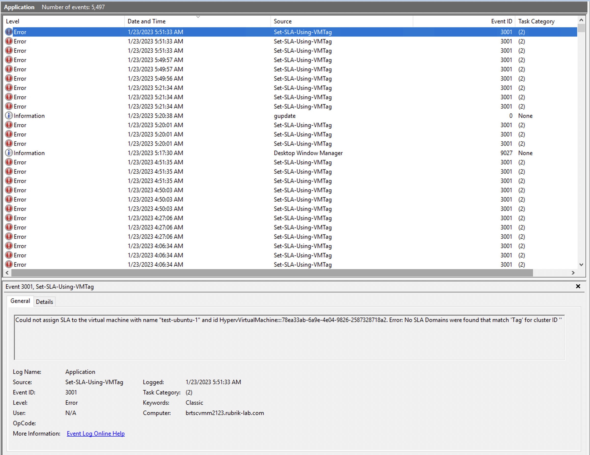
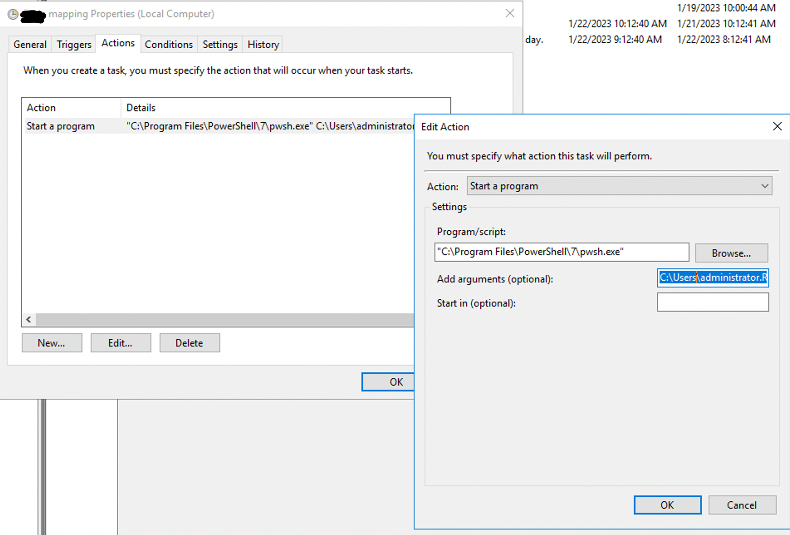
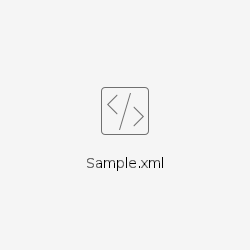

Below are the detailed steps to run the PowerShell script to assign SLA Domains to Hyper-V virtual machines based on the tags assigned to them in SCVMM. The command can run the script once it passes the required parameters:

`.\Set-SLA-Using-VMTag.ps1 -path <absolute path to file containing the cluster detatils> -password_file_path <absolute path to the file containing the encrypted vault password> -mapping_file_path <absolute path to file containing the SLA to tag mapping> -verbose <true or false to enable extra logs> -dry_run <true or false to enable dry run>`

**Important:** USE AT YOUR OWN RISK. Rubrik does not officially support the community tools. Carefully investigate a community tool before using it. Always test a community tool on non-production data before using the tool with production data.

Prerequisites:
---------------

The script needs the following prerequisites to run:

1.  Install PowerShell 7 on the machine where SCVMM is hosted. We recommend using the latest version of PowerShell 7 which can be installed using this [installer](https://github.com/PowerShell/PowerShell/releases/download/v7.3.0/PowerShell-7.3.0-win-x64.msi).
    
2.  The Rubrik, SecretStore, and SecretManagement PowerShell modules need to be installed using the command in PowerShell 6.0+ window with the command **Install-Module -Name <module\_name>**.
    
3.  Create a service account with admin access. Details steps are mentioned below.
    

Instructions
------------------------

The script requires the following parameters:

1.  The path to the CSV file containing the cluster details, user_id and secret of the service account.
    
    1.  Follow the steps mentioned [here](service_account.md) to create the service account.
        
    2.  Follow the steps mentioned [here](windows_vault.md) to store them in the Windows secret store.
        
    3.  Save the file in CSV format with a separate row for every cluster in the format "cluster IP address", "Name of the secret for user", "Name of the secret for secret". Sample content of the file:
        
        1.  ```
            10.0.35.104,rubrik_user,rubrik_key
            10.0.34.151,new_user,new_key
            ```
            
2.  The parameter password\_file\_path takes a text file that contains the encrypted password to the vault used to store the service account user_id and secret. This can be created using the below command  
    "vault\_password" | ConvertTo-SecureString -AsPlainText -Force | ConvertFrom-SecureString | Out-File "path\_to\_store\_the\_password"
    
3.  The path to the JSON file containing the mapping between the tag specified in SCVMM and the SLA Domain that needs to be assigned. Sample content of the file:

        1.  {
                "Test-Gold": "Gold",
                "Test-Silver": "Silver",
                "Test-Bronze": "Bronze",
                "Tag-Bharath": "Bharath",
                "Tag-Fail": "Tag"
            }
            

            
4.  The parameter -verbose indicates whether to have extra logs enabled or not. Passing this as true will print the entire list of virtual machines in SCVMM, Rubrik, and hosts in SCVMM with complete details.
    
5.  The parameter -dry\_run indicates whether to assign the SLA Domain or just display the changes that are going to be done.
    

Debugging:
----------

A log file is created at “%localappdata%/<timestamp>.log for each run of the script. When the script encounters errors, a log is added to the Windows events with the event id as `3001`, source name as `Set-SLA-Using-VMTag.ps1,` and category as 1 for terminal events and as 2 for info events.
Example:



A task can be scheduled in the task scheduler to perform an action such as sending a mail whenever this event is published.

Limitations/Notes:
------------------

1.  The script cannot differentiate virtual machines that are present in the same host with the same name. Hence, the script will log an appropriate error both in the log file and in the Windows event logs. This behavior is fixed in CDM versions 9.0+ and will not require any changes in the current script once CDM is upgraded to that version.
    
2.  The script will overwrite the SLA Domain for the virtual machines even if it is already protected in case the tag/mapping is changed.
    

Steps to run the script from the task scheduler:
------------------------------------------------

The script can be configured to run periodically from the task scheduler on the machine where SCVMM is hosted.

1.  In the actions section, specify the action as “Start a program”.
    
2.  Specify the path of the PowerShell 7 executable in the Program/script section.
    Example: `"C:\Program Files\PowerShell\7\pwsh.exe"`
    
3.  In the arguments section, pass the path of the script followed by the arguments to the script.
     Example:
    
    ```java
    C:\Users\administrator.RUBRIK-LAB\Desktop\Set-SLA-Using-VMTag.ps1 -path C:\Users\administrator.RUBRIK-LAB\Desktop\creds.csv -password_file_path  C:\Users\administrator.RUBRIK-LAB\Desktop\Password.txt -mapping_file_path  C:\Users\administrator.RUBRIK-LAB\Desktop\mapping.json -verbose True
    ```
    



A sample exported task from the task scheduler is attached below.

[](attachments/2661974167/2699788369.xml)